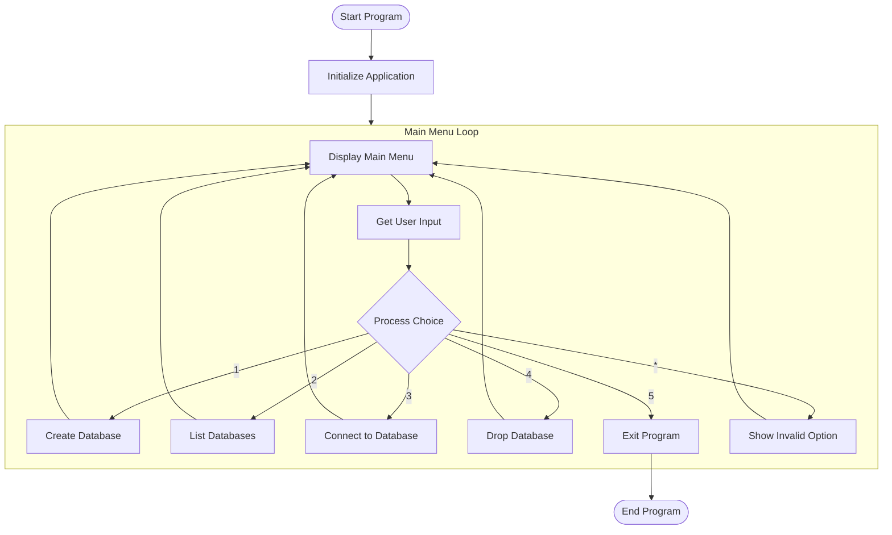
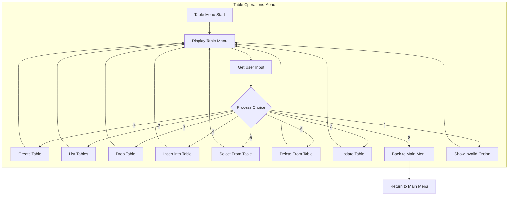

# Bash DBMS Flow Charts

## Main Program Flow

```mermaid
flowchart TD
    Start([Start Program]) --> Init[Initialize Application]
    Init --> MainMenu
    
    subgraph MainMenu [Main Menu Loop]
        MMDisplay[Display Main Menu] --> MMInput[Get User Input]
        MMInput --> MMProcess{Process Choice}
        
        MMProcess -->|1| CreateDB[Create Database]
        MMProcess -->|2| ListDB[List Databases]
        MMProcess -->|3| ConnectDB[Connect to Database]
        MMProcess -->|4| DropDB[Drop Database]
        MMProcess -->|5| Exit[Exit Program]
        MMProcess -->|*| MMInvalid[Show Invalid Option]
        
        CreateDB --> MMDisplay
        ListDB --> MMDisplay
        ConnectDB --> MMDisplay
        DropDB --> MMDisplay
        MMInvalid --> MMDisplay
    end
    
    Exit --> End([End Program])
    
    click CreateDB href "#chart-2-database-operations" "Go to Database Operations"
    click ListDB href "#chart-2-database-operations" "Go to Database Operations"
    click ConnectDB href "#chart-2-database-operations" "Go to Database Operations"
    click DropDB href "#chart-2-database-operations" "Go to Database Operations"

```

## Database Operations

```mermaid
flowchart TD
    subgraph CreateDatabase [Create Database Operation]
        CDBStart[Create Database Start] --> CDBInput[Get DB Name]
        CDBInput --> CDBValidate{Validate DB Name}
        CDBValidate -->|Invalid| CDBError[Show Error Message]
        CDBValidate -->|Valid| CDBCheck{DB Exists?}
        CDBCheck -->|Yes| CDBExists[Show DB Exists Error]
        CDBCheck -->|No| CDBCreate[Create DB Directory]
        CDBCreate --> CDBSuccess[Show Success Message]
        CDBError --> CDBEnd
        CDBExists --> CDBEnd
        CDBSuccess --> CDBEnd[Return to Main Menu]
    end

    subgraph ListDatabases [List Databases Operation]
        LDBStart[List Databases Start] --> LDBCheck{Any Databases?}
        LDBCheck -->|No| LDBEmpty[Show No Databases Message]
        LDBCheck -->|Yes| LDBList[Display All Databases]
        LDBEmpty --> LDBEnd
        LDBList --> LDBEnd[Return to Main Menu]
    end

    subgraph ConnectDatabase [Connect to Database Operation]
        ConnStart[Connect to DB Start] --> ConnInput[Get DB Name]
        ConnInput --> ConnCheck{DB Exists?}
        ConnCheck -->|No| ConnError[Show DB Not Found Error]
        ConnCheck -->|Yes| ConnSet[Set Current Database]
        ConnSet --> ConnSuccess[Show Success Message]
        ConnSuccess --> TableMenu[Go to Table Menu]
        ConnError --> ConnEnd[Return to Main Menu]
    end

    subgraph DropDatabase [Drop Database Operation]
        DDBStart[Drop DB Start] --> DDBInput[Get DB Name]
        DDBInput --> DDBValidate{DB Exists?}
        DDBValidate -->|No| DDBError[Show DB Not Found Error]
        DDBValidate -->|Yes| DDBRemove[Remove DB Directory]
        DDBRemove --> DDBSuccess[Show Success Message]
        DDBError --> DDBEnd
        DDBSuccess --> DDBEnd[Return to Main Menu]
    end
```
## Table Operations Menu

```mermaid

flowchart TD
    subgraph TableMenu [Table Operations Menu]
        TMStart[Table Menu Start] --> TMDisplay[Display Table Menu]
        TMDisplay --> TMInput[Get User Input]
        TMInput --> TMProcess{Process Choice}
        
        TMProcess -->|1| CreateTable[Create Table]
        TMProcess -->|2| ListTables[List Tables]
        TMProcess -->|3| DropTable[Drop Table]
        TMProcess -->|4| InsertTable[Insert into Table]
        TMProcess -->|5| SelectTable[Select From Table]
        TMProcess -->|6| DeleteTable[Delete From Table]
        TMProcess -->|7| UpdateTable[Update Table]
        TMProcess -->|8| BackToMain[Back to Main Menu]
        TMProcess -->|*| TMInvalid[Show Invalid Option]
        
        CreateTable --> TMDisplay
        ListTables --> TMDisplay
        DropTable --> TMDisplay
        InsertTable --> TMDisplay
        SelectTable --> TMDisplay
        DeleteTable --> TMDisplay
        UpdateTable --> TMDisplay
        TMInvalid --> TMDisplay
    end
    
    BackToMain --> MainMenu[Return to Main Menu]
    
    click CreateTable href "#chart-4-table-operations" "Go to Table Operations"
    click ListTables href "#chart-4-table-operations" "Go to Table Operations"
    click DropTable href "#chart-4-table-operations" "Go to Table Operations"
    click InsertTable href "#chart-4-table-operations" "Go to Table Operations"
    click SelectTable href "#chart-4-table-operations" "Go to Table Operations"
    click DeleteTable href "#chart-4-table-operations" "Go to Table Operations"
    click UpdateTable href "#chart-4-table-operations" "Go to Table Operations"
```

## Table Operations

```mermaid
flowchart TD
    subgraph CreateTableOp [Create Table Operation]
        CTStart[Create Table Start] --> CTInput[Get Table Name]
        CTInput --> CTValidate{Validate Table Name}
        CTValidate -->|Invalid| CTError[Show Error Message]
        CTValidate -->|Valid| CTCheck{Table Exists?}
        CTCheck -->|Yes| CTExists[Show Table Exists Error]
        CTCheck -->|No| CTGetCols[Get Column Definitions]
        CTGetCols --> CTValidateCols{Valid Columns?}
        CTValidateCols -->|No| CTColError[Show Column Error]
        CTValidateCols -->|Yes| CTCreateMeta[Create Metadata File]
        CTCreateMeta --> CTCreateTable[Create Table File]
        CTCreateTable --> CTSuccess[Show Success Message]
        CTError --> CTEnd
        CTExists --> CTEnd
        CTColError --> CTEnd
        CTSuccess --> CTEnd[Return to Table Menu]
    end

    subgraph ListTablesOp [List Tables Operation]
        LTStart[List Tables Start] --> LTCheck{Any Tables?}
        LTCheck -->|No| LTEmpty[Show No Tables Message]
        LTCheck -->|Yes| LTList[Display All Tables]
        LTEmpty --> LTEnd
        LTList --> LTEnd[Return to Table Menu]
    end

    subgraph DropTableOp [Drop Table Operation]
        DTStart[Drop Table Start] --> DTInput[Get Table Name]
        DTInput --> DTCheck{Table Exists?}
        DTCheck -->|No| DTError[Show Table Not Found Error]
        DTCheck -->|Yes| DTRemove[Remove Table & Metadata Files]
        DTRemove --> DTSuccess[Show Success Message]
        DTError --> DTEnd
        DTSuccess --> DTEnd[Return to Table Menu]
    end

    subgraph InsertTableOp [Insert Into Table Operation]
        ITStart[Insert Start] --> ITInput[Get Table Name]
        ITInput --> ITCheck{Table Exists?}
        ITCheck -->|No| ITError[Show Table Not Found Error]
        ITCheck -->|Yes| ITReadMeta[Read Table Metadata]
        ITReadMeta --> ITGetValues[Get Column Values]
        ITGetValues --> ITValidate{Valid Values?}
        ITValidate -->|No| ITValueError[Show Value Error]
        ITValidate -->|Yes| ITCheckPK{Primary Key Unique?}
        ITCheckPK -->|No| ITPKError[Show PK Error]
        ITCheckPK -->|Yes| ITSave[Save Record to Table]
        ITSave --> ITSuccess[Show Success Message]
        ITError --> ITEnd
        ITValueError --> ITEnd
        ITPKError --> ITEnd
        ITSuccess --> ITEnd[Return to Table Menu]
    end
```